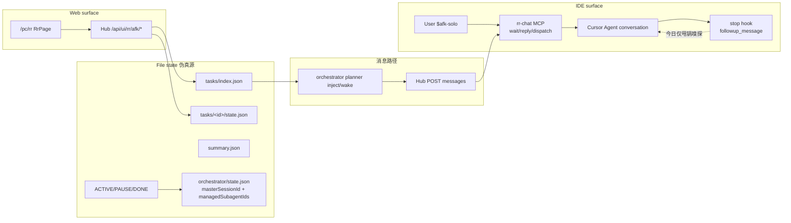

# AFK vNext Discovery — 2026-07-31

> Step 0 事实核验。禁止凭想象实现。本文件是后续 ADR / 实施的证据底稿。

## 0. 现场保护

| 项 | 值 |
|----|-----|
| 仓库 | `~/Polarisor/PolarCopilot` |
| 分支 | `dev/hubweb-prompts-ui` @ `74ab394` |
| 未提交改动 | 39 已跟踪文件 + 若干 untracked（AFK budget/fleet UI/skills） |
| `git diff --stat` | +1723 / −330（摘要） |
| 策略 | **不** reset/checkout/clean/stash；vNext 在兼容现有改动的路径落地（`hub/src/rr/afk/vnext/`） |
| PolarPort | healthy `:11050` |
| PolarProcess | healthy `:11055` |
| PolarBudget | **不可达** `:11060` → 标注 `budget_unavailable`；并发保守=1 |
| Runtime audit | `compliant` |

重叠文件（本重构与现有未提交改动交叉）：`hub/src/rr/afk/*`、`hub/src/rr/orchestrator/*`、`.cursor/skills/afk*`、`web/src/pages/RrPage.tsx`、`web/src/lib/rr-afk.ts`。新增代码优先 `vnext/` 旁路，经 facade 接入，避免覆盖用户进行中的 fleet-10 改动意图。

---

## 1. Cursor CLI 真实能力（不得编造）

**命令**：`cursor-agent --help`（binary `~/.local/bin/cursor-agent`，version `2026.07.23-e383d2b`）

**已证实 resume 相关 flags / commands**（证据：`docs/superpowers/evidence/2026-07-31-afk-vnext-cli-resume.txt`）：

| 能力 | 原文 |
|------|------|
| `--resume [chatId]` | Select a session to resume |
| `--continue` | Continue previous session |
| `create-chat` | Create a new empty chat and return its ID |
| `resume` | Resume the latest chat session |
| `ls` | Resume a chat session（list/select） |
| `-p/--print` | Headless；`--output-format text\|json\|stream-json` |
| `--workspace` | Workspace directory |
| `-w/--worktree` | Isolated git worktree |

**Web 适配器结论**：CLI **有原生 resume**（`--resume <chatId>` / `--continue` / `agent resume`）。Supervisor 优先用 PolarProcess 托管 `cursor-agent --resume <native_handle> -p …`；仅当 resume 失败时再以状态工件生成最小恢复 Prompt 开新 attempt（仍同 task/run）。

官方 docs：https://cursor.com/docs/cli/overview

---

## 2. Cursor Hooks 与 stop 续跑能力

### 2.1 当前用户级配置 `~/.cursor/hooks.json`

```json
{
  "version": 1,
  "hooks": {
    "beforeShellExecution": [{ "command": "hooks/polar-runtime-guard.sh", "timeout": 10 }],
    "afterAgentResponse": [{ "command": "hooks/manual-handoff-guard.sh", "timeout": 5 }],
    "stop": [{ "command": "hooks/manual-handoff-guard.sh", "timeout": 5, "loop_limit": 3 }]
  }
}
```

### 2.2 stop 事件 stdin 字段（官方 + 本地实证）

来源：https://cursor.com/docs/hooks.md ；本地 `manual-handoff-guard.sh` 已读取：

- `hook_event_name`（`stop` / `afterAgentResponse`）
- `conversation_id`
- `status`（`completed` | `aborted` | `error`）
- `loop_count`（本脚本已触发的自动 follow-up 次数，从 0）
- `workspace_roots[]`
- `generation_id` / `model` / `transcript_path`（官方 schema）

**stdout 续跑契约（Cursor native）**：

```json
{ "followup_message": "<下一轮用户消息>" }
```

`loop_limit` 在 hooks.json 可配；`null` = 无上限。默认 Cursor 侧约 5。

### 2.3 Spike（可回滚，未改 live hooks.json）

脚本：`hub/scripts/afk-vnext-stop-spike.sh`（合成 stdin，**未**安装进 `~/.cursor/hooks.json`）

| Case | 输入 | 输出 |
|------|------|------|
| A gate unmet | stop+completed+`afk_gate_pass=false` | `followup_message` 含 conversation+cwd |
| B gate pass | `afk_gate_pass=true` | `{}` |
| C aborted | status=aborted | `{}` |
| D live guard | 现有 `manual-handoff-guard.sh` + flag | 真实 `followup_message`（甩锅打回） |

**结论**：同一 IDE conversation **可被** `followup_message` 连续唤回。IDE 适配器可用 `conversation_id` + `workspace_roots[0]` 查 AFK DB task，**不需要** rr sessionId。  
注意：`loop_limit` 硬顶存在——外层「无限」需组合：提高/置 null 的 AFK stop hook + supervisor 侧 CLI resume（Web）+ 压缩后从 DB/CRITERIA 恢复。Hook **只防提前停**，不判 PASS。

---

## 3. 现有 AFK/Rr/MCP 依赖图



**四层混淆（现状问题）**：`surface`（IDE/Web）、`executor`（native/CLI）、`discipline`（AFK solo/start/go）、`control-plane`（文件状态+MCP 邮箱）混在同一套 Rr/AFK 叙事里。

---

## 4. AFK 专用 MCP 清单（退役候选）vs 能力型保留

来源：`~/.cursor/mcp.json`（共 41 servers）

### 4.1 AFK / 消息控制面（默认路径应禁用）

| Server | 角色 |
|--------|------|
| `rr-chat` | Rr AFK 邮箱 / wait_message 总线 |
| `hub-agent-1` … `hub-agent-20` | Hub 对话槽位 MCP |
| `xj-chat` | 已废弃 XJ 消息 MCP |
| `my-mcp-1` … `my-mcp-5` | 历史消息卡会话重复通道 |

### 4.2 能力型（保留）

示例：`figma`、`playwright`、`chrome-devtools`、`safari-mcp-stp`、`tencent-docs`、`doc-mcp`、`sheet-mcp`、`slide-mcp`、`fetch`、`context7`、`semgrep`、`memory`、`sequential-thinking` 等。

### 4.3 两阶段迁移

1. Feature flag 默认关；安装脚本停止安装 AFK 控制面 MCP；skills 改写；保留只读导出。
2. vNext 验收后移 ClawBin / 删除物理实现。

---

## 5. 基线测试

```text
VERIFY_CMD: cd hub && npm test -- --run tests/rr/afk-store.test.ts tests/rr/afk-api.test.ts tests/rr/budget-shedder.test.ts tests/rr/master-orchestrator-discipline.test.ts tests/rr/orchestrator-planner-afk.test.ts tests/rr/afk-service-ssot.test.ts
EXPECT: exit 0
RESULT: exit 0 | Test Files 6 passed | Tests 46 passed | Duration ~2.28s
EVIDENCE: docs/superpowers/evidence/2026-07-31-afk-vnext-baseline-tests.txt
```

注：基线全绿**不**证明缺陷不存在——现有测试未覆盖「假 DONE / 跨 task 串线 / completion gate」。

---

## 6. 十大缺陷（研究确认，均有 path:line）

| # | 缺陷 | 证据锚点 |
|---|------|----------|
| 1 | `active`∧`done` 可同真；DONE 可留在 `active_tasks` | `afk-service.ts` ~414–420；`store.ts` markTaskDone early-return |
| 2 | `ACTIVE`/`PAUSE`/`DONE` 文件可共存 | `orchestrator/afk-state.ts` 独立 existsSync；migrate 不删 legacy |
| 3 | `markTaskDone` 已 DONE 提前 return，不修 index | `store.ts:194-197` |
| 4 | `doneAfk` 无 CRITERIA/TODO/证据门 | `afk-service.ts:757-767` |
| 5 | 默认 `npm test` 判据 + 假 U1，先 inject 后冻结 | `store.ts:111-120` init/migrate |
| 6 | 枚举有 RUNNING/UNIT_DONE/READY_TO_MERGE 无受控转换 | `types.ts:1-11`；无 writers |
| 7 | dispatch 无 AFK task ownership | `rr/store.ts` dispatch；`dispatch-guard.ts` 仅 mode=go |
| 8 | 全局 `managedSubagentIds` / `masterSessionId` 跨 task | `orchestrator/config.ts` + `state.ts` + `runner.ts` |
| 9 | `.index.lock` 忙等 5s 后 throw，无 pid stale reclaim | `store.ts` index lock |
| 10 | 测注入 fan-out，不测隔离/完成门 | `orchestrator-multi-task.test.ts` 等 |

详细行号见 researcher 报告（会话内）。

---

## 7. SOTA 检索日志

### Question A — IDE 如何在 agent stop 后续跑同一 conversation？

| Source | Key point | URL |
|--------|-----------|-----|
| Cursor Hooks docs | stop → stdout `{followup_message}`；`loop_count`/`loop_limit` | https://cursor.com/docs/hooks.md |
| Third-party hooks | Claude `decision:block` ≡ Cursor followup | https://cursor.com/docs/reference/third-party-hooks |
| Local spike + manual-handoff-guard | 契约可执行 | `hub/scripts/afk-vnext-stop-spike.sh` |

**Decision**: IDE executor = Cursor native + conversation-aware stop hook；lookup key = `conversation_id`+cwd，不是 MCP sessionId。

### Question B — Web 无头执行器如何 resume？

| Source | Key point | URL |
|--------|-----------|-----|
| `cursor-agent --help` | `--resume [chatId]`、`--continue`、`create-chat` | local CLI 2026.07.23 |
| Cursor CLI overview | `agent ls` / `agent resume` / `--resume=` | https://cursor.com/docs/cli/overview |

**Decision**: Web executor = PolarProcess 托管 `cursor-agent`；native_handle=chatId；resume 优先，失败则新 attempt + 恢复 Prompt。

### Question C — 任务状态真源模式

| Source | Key point | URL |
|--------|-----------|-----|
| 项目已有 | better-sqlite3 + drizzle WAL 于 `hub/src/persistence/db.ts` | 本地 |
| Expand/contract | 文件 JSON → SQLite 旁路 → 切读 → 退役文件真源 | 工程惯例 |

**Decision**: 新 DB `~/.polar-copilot/afk/afk.db`（WAL）；人类可读 CRITERIA/TODO 仍落 task 目录但非运行状态真源。

---

## 8. 产品概念收敛（对外）

| 用户可见 | 含义 |
|----------|------|
| `afk-start` | 先商讨再执行 |
| `afk-solo` | never-ask 自治到完成或真实 NEEDS_HUMAN |
| `afk` | 仅路由到以上二者 |

| 退役/内化 | 处理 |
|-----------|------|
| `afk-go` | 退役用户模式（MCP 传输特例） |
| `Rr` | 非用户模式；Run Registry/兼容层 |
| `rr-orchestrator` | → transport-neutral AFK supervisor |
| AFK 控制面 MCP | 两阶段禁用 |

**分层**：`surface` ∈ {ide, web} · `executor` ∈ {cursor-native, cursor-cli} · `discipline`=AFK · `control-plane`=SQLite 状态机。

---

## 9. 基线 vs vNext VERIFY（后续 Steps）

```text
Step1 VERIFY_CMD: cd hub && npm test -- --run tests/rr/afk-vnext-*.test.ts
Step2 VERIFY_CMD: 同上 + completion-gate 拒绝假 DONE
…
最终：IDE 两路 + Web 两路 + 混合 + 故障注入；证据新鲜落盘
```

## 10. 开放风险

1. stop `loop_limit` 与「外层无限」需产品级策略（建议 AFK hook `loop_limit: null` + 终局门清零）。
2. Budget 离线：admission≠execution；execution concurrency=1，任务进 QUEUED。
3. 现有未提交 fleet-10 改动：vNext 接纳「多 task 登记」，但**废除** Budget 不可达时 floor=10 强跑。
